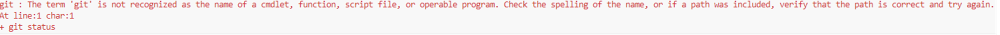

# Swedbank Pay Design Guide Theme for Jekyll

![Swedbank Pay Design Guide Theme for Jekyll][opengraph-image]

![Test status][test-badge]
![Deploy status][deploy-badge]
[![License][license-badge]][license]
[![Codacy][codacy-badge]][codacy]
[![CLA assistant][cla-badge]][cla]
[![Contributor Covenant][coc-badge]][coc]

This repository hosts the [Swedbank Pay Design Guide][design-guide] theme for
Jekyll, used for [Swedbank Pay Developer Portal][developer-portal] among other
things.

## Usage

To view this theme, browse to [swedbankpay.github.io][swedbankpay]. If you'd
like to host it locally on your computer, you have two options, manual install
or [Docker][docker].
The Docker installation is the one we recommend to use for its simplicity.

After either a Docker or manual installation Jekyll should be fired up with this theme. You can now add pages, documents,
data, etc. like normal to test your theme's contents. As you make modifications to your theme and to your content, the site will regenerate and you should see
the changes in the browser after a refresh, just like normal.

When the theme is released, only the files in `_layouts`, `_includes`, `_sass` and `assets` tracked with Git will be bundled. To add a custom directory to your
theme-gem, please edit the regexp in `swedbankpay.gemspec` accordingly.

### Docker (recommended)

1.  [Clone this repository][clone].
2.  [Install Docker Personal][docker]. Select default settings when prompted.
3.  Open a console window at the root of the repository and run `docker-compose up`. This will create and run a docker container.
    Everything specified in the repository `gemfile` will be installed and run in the container.
5.  Run Visual Studio Code (VSC) and open the repository.
6.  Verify that Git is installed by running `git status` in VSC terminal.
   If Git is not properly installed, you will see an error message like the one below. Just [download Git][git] and install.
   
7.  Once Docker and Git are installed, run `bundle install` in VSC terminal.
8.  If needed, run `bundle update`.
9.  Run `bundle exec jekyll serve` to start the website.
10. Open `http://localhost:4000` in a browser.
   

### Manual install

1.  [Clone this repository][clone].
2.  Jekyll is written in [Ruby][ruby], so you'll need to download and install
    that. If you're installing on Windows, choose setup with DevKit.
3.  To install the [Ruby Gems][gems] this web site requires, you first need to
    install [Bundler][bundler].
4.  Install [Graphviz][graphviz], this will require Java.
5.  Once Ruby ,Bundler, and Graphviz, is in place, type `bundle install` inside the root
    folder of this repository.
6.  Run `bundle exec jekyll serve` to start the website.
7.  Open `http://localhost:4000` in a browser.

## Contributing

Bug reports and pull requests are welcome on [GitHub][github]. This project is
intended to be a safe, welcoming space for collaboration, and contributors are
expected to adhere to the [code of conduct][coc] and sign the
[contributor's license agreement][cla].

## License

The code within this repository is available as open source under the terms of
the [Apache 2.0 License][license] and the [contributor's license
agreement][cla].

[bundler]:              <https://bundler.io/>
[cla-badge]:            <https://cla-assistant.io/readme/badge/SwedbankPay/swedbank-pay-design-guide-jekyll-theme>
[cla]:                  <https://cla-assistant.io/SwedbankPay/swedbank-pay-design-guide-jekyll-theme>
[clone]:                <https://help.github.com/articles/cloning-a-repository/>
[coc-badge]:            <https://img.shields.io/badge/Contributor%20Covenant-v2.0%20adopted-ff69b4.svg>
[coc]:                  <./CODE_OF_CONDUCT.md>
[codacy-badge]:         <https://app.codacy.com/project/badge/Grade/30ebfb7d531a488484e87dd428034af7>
[codacy]:               <https://www.codacy.com/gh/SwedbankPay/swedbank-pay-design-guide-jekyll-theme/dashboard?utm_source=github.com&amp;utm_medium=referral&amp;utm_content=SwedbankPay/swedbank-pay-design-guide-jekyll-theme&amp;utm_campaign=Badge_Grade>
[deploy-badge]:         <https://github.com/SwedbankPay/swedbank-pay-design-guide-jekyll-theme/workflows/Deploy/badge.svg>
[design-guide]:         <https://design.swedbankpay.com/>
[developer-portal]:     <https://developer.swedbankpay.com/>
[docker]:               <https://www.docker.com/>
[gems]:                 <https://rubygems.org/>
[git]:                  <https://git-scm.com/downloads>
[github]:               <https://github.com/SwedbankPay/swedbank-pay-design-guide-jekyll-theme>
[graphviz]:             <https://graphviz.org/download/>
[license-badge]:        https://img.shields.io/github/license/SwedbankPay/swedbank-pay-design-guide-jekyll-theme
[license]:              <https://opensource.org/licenses/MIT>
[liquid]:               <https://jekyllrb.com/docs/liquid/>
[opengraph-image]:      <https://repository-images.githubusercontent.com/209270355/36818080-53ee-11ea-896c-082addb851a6>
[ruby]:                 <https://www.ruby-lang.org/en/>
[swedbankpay]:          <https://swedbankpay.github.io/swedbank-pay-design-guide-jekyll-theme/>
[test-badge]:           <https://github.com/SwedbankPay/swedbank-pay-design-guide-jekyll-theme/workflows/Test/badge.svg>
[vsc-ruler]:            <https://stackoverflow.com/questions/29968499/vertical-rulers-in-visual-studio-code>
