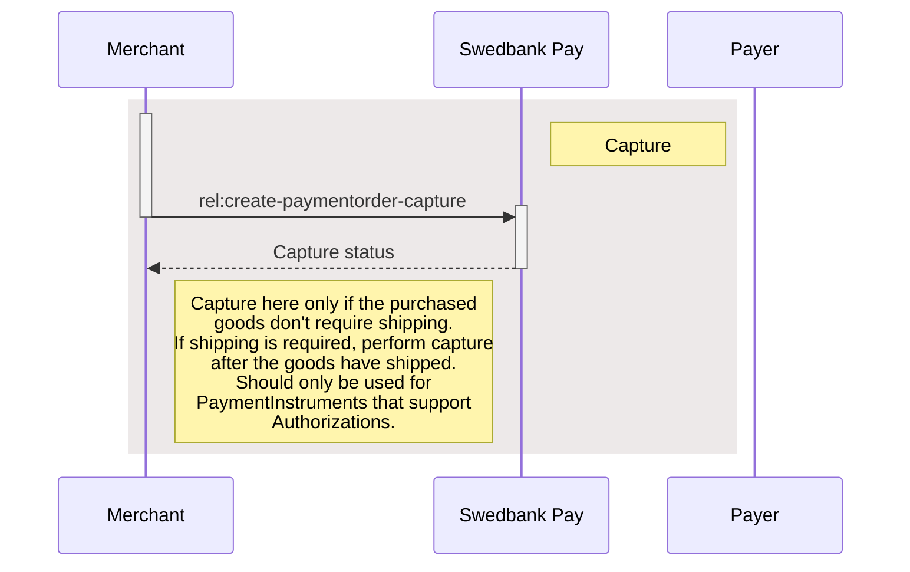

## Step 5: Capture the funds

Capture can only be done on a payment with a successful authorized transaction,
and if the authorization was not done on a one-phase payment instrument.
Examples of one-phase payment instruments are Swish and Vipps,
 while payment instruments such as Credit Card are two-phase payments,
 requiring a `Capture` to be performed.

It is possible to do a part-capture where you only capture a smaller amount
than the authorized amount. You can later do more captures on the same payment
up to the total authorization amount.

This is done by requesting the order information from the server, to get the
request link to perform the capture. With this, you can request the capture
with the sum to capture, and get back the status.



To capture the authorized payment, we need to perform
`create-paymentorder-capture` against the accompanying `href` returned in the
`operations` list. See the abbreviated request and response below:

{:.code-header}
**Request**

```http
POST /psp/paymentorders/{{ page.payment_order_id }}/captures HTTP/1.1
Host: {{ page.api_host }}
Authorization: Bearer <AccessToken>
Content-Type: application/json

{
    "transaction": {
        "description": "Capturing the authorized payment",
        "amount": 1500,
        "vatAmount": 375,
        "payeeReference": "AB832",
        "receiptReference": "AB831",
        "orderItems": [
            {
                "reference": "P1",
                "name": "Product1",
                "type": "PRODUCT",
                "class": "ProductGroup1",
                "itemUrl": "https://example.com/products/123",
                "imageUrl": "https://example.com/product123.jpg",
                "description": "Product 1 description",
                "discountDescription": "Volume discount",
                "quantity": 4,
                "quantityUnit": "pcs",
                "unitPrice": 300,
                "discountPrice": 200,
                "vatPercent": 2500,
                "amount": 1000,
                "vatAmount": 250
            },
            {
                "reference": "P2",
                "name": "Product2",
                "type": "PRODUCT",
                "class": "ProductGroup1",
                "description": "Product 2 description",
                "quantity": 1,
                "quantityUnit": "pcs",
                "unitPrice": 500,
                "vatPercent": 2500,
                "amount": 500,
                "vatAmount": 125
            }
        ]
    }
}
```

**Et voilà!** Checkout should now be complete, the payment should be secure and
everyone should be happy. But, sometimes you also need to implement the
cancellation and reversal operations described below.


