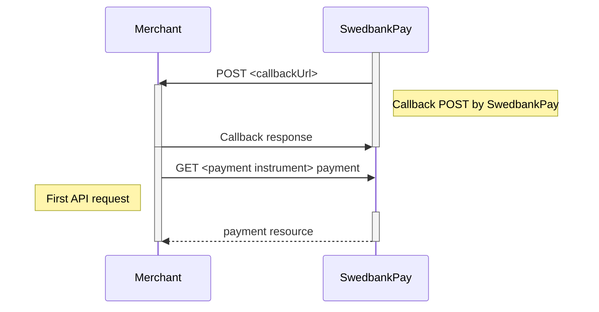



Text can be **bold**, _italic_, or ~~strikethrough~~.

*   [External absolute full link](https://www.wikipedia.org)
*   [External protocol relative link](//www.wikipedia.org)
*   Internal absolute full link
*   Internal explicit relative link
*   Internal implicit relative link
*   Internal absolute link

There should be whitespace between paragraphs.

There should be whitespace between paragraphs. We recommend including a README,
or a file with information about your project.

## Header 2

This is a normal paragraph following a header. GitHub is a code hosting platform
for version control and collaboration. It lets you and others work together on
projects from anywhere.

> This is a blockquote following a header.
>
> When something is important enough, you do it even if the odds are not in
> your favor.

### Header 3

{:.code-view-header}
JavaScript code with syntax highlighting.

```js
var fun = function lang(l) {
  dateformat.i18n = require('./lang/' + l)
  return true;
}
```

{:.code-view-header}
HTTP request

```http
POST /psp/consumers HTTP/1.1
Host: api.externalintegration.payex.com
Authorization: Bearer <AccessToken>
Content-Type: application/json

{
    "operation": "initiate-consumer-session",
    "msisdn": "+4798765432",
    "email": "olivia.nyhuus@example.com",
    "consumerCountryCode": "NO",
    "nationalIdentifier": {
        "socialSecurityNumber": "26026708248",
        "countryCode": "NO"
    }
}
```

{:.code-view-header}
Response

```http
HTTP/1.1 200 OK
Content-Type: application/json

{
    "payment": "/psp/creditcard/payments/{{ page.payment_id }}",
    "authorization": {
        "direct": true,
        "cardBrand": "Visa",
        "cardType": "Credit",
        "issuingBank": "Utl. Visa",
        "paymentToken": "{{ page.payment_token }}",
        "maskedPan": "454778******3329",
        "expiryDate": "12/2020",
        "panToken": "cca2d98d-8bb3-4bd6-9cf3-365acbbaff96",
        "panEnrolled": true,
        "acquirerTransactionTime": "0001-01-01T00:00:00Z",
        "id": "/psp/creditcard/payments/7e6cdfc3-1276-44e9-9992-7cf4419750e1/authorizations/ec2a9b09-601a-42ae-8e33-a5737e1cf177",
        "transaction": {
            "id": "/psp/creditcard/payments/7e6cdfc3-1276-44e9-9992-7cf4419750e1/transactions/ec2a9b09-601a-42ae-8e33-a5737e1cf177",
            "created": "2020-03-10T13:15:01.9586254Z",
            "updated": "2020-03-10T13:15:02.0493818Z",
            "type": "Authorization",
            "state": "AwaitingActivity",
            "number": 70100366758,
            "amount": 4201,
            "vatAmount": 0,
            "description": "Test transaction",
            "payeeReference": "1583846100",
            "isOperational": true,
            "operations": [
                {
                    "method": "GET",
                    "href": "https://api.stage.payex.com/psp/creditcard/confined/payments/authorizations/authenticate/ec2a9b09-601a-42ae-8e33-a5737e1cf177",
                    "rel": "redirect-authentication"
                }
            ]
        }
    }
}
```

{:.code-view-header}
JSON

```json
{
    "operation": "initiate-consumer-session",
    "msisdn": "+4798765432",
    "email": "olivia.nyhuus@example.com",
    "consumerCountryCode": "NO",
    "nationalIdentifier": {
        "socialSecurityNumber": "26026708248",
        "countryCode": "NO"
    }
}
```

Here's some `<inline>`{:.language-html .highlight}
`{ "code": true }`{:.language-js .highlight}
that should `.be { highlighted: according; }`{:.language-css .highlight} to
their language.

#### Header 4

*   This is an unordered list following a header.
*   This is an unordered list following a header.
*   This is an unordered list following a header.

##### Header 5

1. This is an ordered list following a header.
2. This is an ordered list following a header.
3. This is an ordered list following a header.

###### Header 6

Here's a nice, striped table.

{:.table .table-striped}
| head1        | head two          | three |
| :----------- | :---------------- | :---- |
| ok           | good swedish fish | nice  |
| out of stock | good and plenty   | nice  |
| ok           | good `oreos`      | hmm   |
| ok           | good `zoute` drop | yumm  |

## Mermaid



## Alerts









## Jumbotron



## Iterator





## There's a horizontal rule below this

---

## Here is an unordered list

*   Item foo
*   Item bar
*   Item baz
*   Item zip

## And an ordered list

1. Item one
2. Item two
3. Item three
4. Item four

## And a nested list

*   level 1 item
  *   level 2 item
  *   level 2 item
  *   level 3 item
  *   level 3 item
*   level 1 item
  *   level 2 item
  *   level 2 item
  *   level 2 item
*   level 1 item
  *   level 2 item
  *   level 2 item
*   level 1 item

## Small image


## Large image


## Definition lists can be used with HTML syntax

<dl>
    <dt>Name</dt>
    <dd>Godzilla</dd>
    <dt>Born</dt>
    <dd>1952</dd>
    <dt>Birthplace</dt>
    <dd>Japan</dd>
    <dt>Color</dt>
    <dd>Green</dd>
</dl>

```plain
Long, single-line code blocks should not wrap. They should horizontally scroll if they are too long. This line should be long enough to demonstrate this.
```

```plain
The final element.
```

## Emoji support

:+1: :heavy_check_mark: :fire: 💡 :unicorn:

## Material design icons

   
 


[internal-absolute-full-link]: {{ site.url }}
[explicit-relative-link]: ./page1
[implicit-relative-link]: page1
[internal-absolute-link]: /page1
