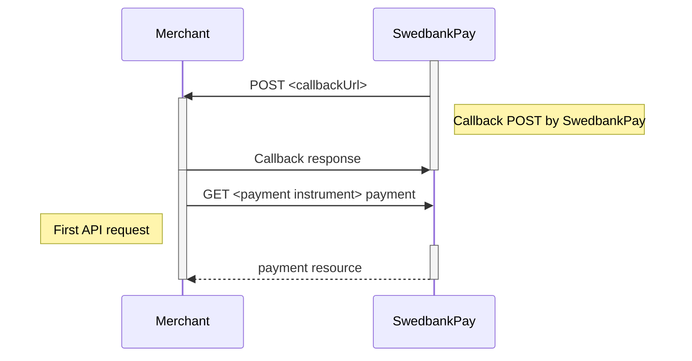

Text can be **bold**, _italic_, or ~~strikethrough~~.

[Link to another page](./another-page.html).

There should be whitespace between paragraphs.

There should be whitespace between paragraphs. We recommend including a README, or a file with information about your project.

## Header 2

This is a normal paragraph following a header. GitHub is a code hosting platform for version control and collaboration. It lets you and others work together on projects from anywhere.

> This is a blockquote following a header.
>
> When something is important enough, you do it even if the odds are not in your favor.

### Header 3

{:.code-header}
**JavaScript code with syntax highlighting.**

```js
var fun = function lang(l) {
  dateformat.i18n = require('./lang/' + l)
  return true;
}
```

{:.code-header}
**HTTP request**

```http
POST /psp/consumers HTTP/1.1
Host: api.externalintegration.payex.com
Authorization: Bearer <AccessToken>
Content-Type: application/json

{
    "operation": "initiate-consumer-session",
    "msisdn": "+4798765432",
    "email": "olivia.nyhuus@example.com",
    "consumerCountryCode": "NO",
    "nationalIdentifier": {
        "socialSecurityNumber": "26026708248",
        "countryCode": "NO"
    }
}
```

Here's some `<inline>`{:.language-html} `{ "code": true }`{:.language-js}
that should `.be { highlighted: according }`{:.language-css} to their
language.

#### Header 4

* This is an unordered list following a header.
* This is an unordered list following a header.
* This is an unordered list following a header.

##### Header 5

1. This is an ordered list following a header.
2. This is an ordered list following a header.
3. This is an ordered list following a header.

###### Header 6

Here's a nice, striped table.

{:.table .table-striped}
| head1        | head two          | three |
|:-------------|:------------------|:------|
| ok           | good swedish fish | nice  |
| out of stock | good and plenty   | nice  |
| ok           | good `oreos`      | hmm   |
| ok           | good `zoute` drop | yumm  |

## Mermaid



## Alerts









## Jumbotron



## There's a horizontal rule below this

* * *

## Here is an unordered list

* Item foo
* Item bar
* Item baz
* Item zip

## And an ordered list

1. Item one
1. Item two
1. Item three
1. Item four

## And a nested list

* level 1 item
  * level 2 item
  * level 2 item
    * level 3 item
    * level 3 item
* level 1 item
  * level 2 item
  * level 2 item
  * level 2 item
* level 1 item
  * level 2 item
  * level 2 item
* level 1 item

## Small image


## Large image


## Definition lists can be used with HTML syntax.

<dl>
    <dt>Name</dt>
    <dd>Godzilla</dd>
    <dt>Born</dt>
    <dd>1952</dd>
    <dt>Birthplace</dt>
    <dd>Japan</dd>
    <dt>Color</dt>
    <dd>Green</dd>
</dl>

```
Long, single-line code blocks should not wrap. They should horizontally scroll if they are too long. This line should be long enough to demonstrate this.
```

```
The final element.
```
