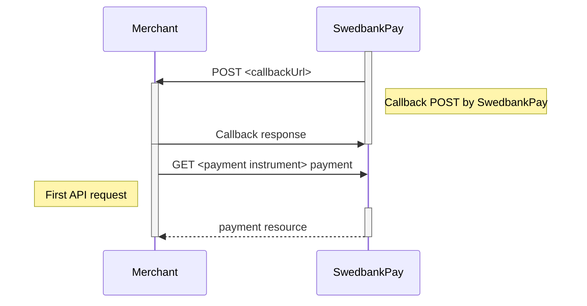

Text can be **bold**, _italic_, or ~~strikethrough~~.

*   [External absolute full link](https://www.wikipedia.org)
*   Internal absolute full link
*   Internal explicit relative link
*   Internal implicit relative link
*   Internal absolute link

There should be whitespace between paragraphs.

There should be whitespace between paragraphs. We recommend including a README,
or a file with information about your project.

___

## Header 2

This is a normal paragraph following a header. GitHub is a code hosting platform
for version control and collaboration. It lets you and others work together on
projects from anywhere.

> This is a blockquote following a header.
>
> When something is important enough, you do it even if the odds are not in
> your favor.

___

### Header 3

This is a normal paragraph following a header 3.

___

#### Header 4

*   This is an unordered list following a header 4.
*   This is an unordered list following a header 4.
*   This is an unordered list following a header 4.

___

##### Header 5

1.  This is an ordered list following a header 5.
2.  This is an ordered list following a header 5.
3.  This is an ordered list following a header 5.

___

###### Header 6

This is a normal paragraph following a header 6.

___

## Accordion


Here's an accordion with default headers and style, and unformatted content.




{: .p .pl-3 .pr-3  }
Here's an accordion with the same header and style on both expand and collapse. The content is formatted as one paragraph with padding.




{: .p .pl-3 .pr-3  }
Here's an accordion with the different header and style on expand and collapse.

{: .p .pl-3 .pr-3  }
Here we have also formatted the content as two paragraphs with padding.



___

## Cards

<div class="row mt-4">
    <div class="col">
        
    </div>
    <div class="col">
        
    </div>
</div>
<div class="row mt-4">
    <div class="col">
        
    </div>
    <div class="col">
        {% include card.html title='Card with image, icon and button text'
            cta_text='CTA text'
            image_alt_text="The image shows someone seated in a cafe with a glass of juice, a cup of coffee and a cake on the table infront of them, using a card terminal to pay."
            image_src="/assets/img/betala-med-pax-a920pro.jpg"
            description='Note that image cards will not display any icon if the card has an image.'
            icon_content="at-check-circle"
            url='/cards/'
        %}
    </div>
</div>
<div class="row mt-4">
    <div class="col">
        
    </div>
    <div class="col">
        
    </div>
</div>

<div class="row mt-4">
    <div class="col">
        
    </div>
    <div class="col">
        
    </div>
</div>

___

## Tabs



___
___

## Table

Here's a nice table.

{:.table .table-plain}

| col one        | col two          | col three |
| :----------- | :---------------- | :---- |
| ok           | good swedish fish | nice  |
| out of stock | good and plenty   | nice  |
| ok           | good `oreos`      | hmm   |
| ok           | good `zoute` drop | yumm  |

Here's a striped table.

{:.table .table-striped}

| col one        | col two          | col three |
| :----------- | :---------------- | :---- |
| ok           | good swedish fish | nice  |
| out of stock | good and plenty   | nice  |
| ok           | good `oreos`      | hmm   |
| ok           | good `zoute` drop | yumm  |

___

## Code examples

{:.code-view-header}
JavaScript code with syntax highlighting.

```js
var fun = function lang(l) {
  dateformat.i18n = require('./lang/' + l)
  return true;
}
```

{:.code-view-header}
HTTP request

```http
POST /psp/consumers HTTP/1.1
Host: api.externalintegration.payex.com
Authorization: Bearer <AccessToken>
Content-Type: application/json
```

{:.code-view-header}
HTTP response

```http
HTTP/1.1 200 OK
Content-Type: application/json
```

````http
POST /psp/consumers HTTP/1.1
Host: api.externalintegration.payex.com
Authorization: Bearer <AccessToken>
Content-Type: application/json
````

{:.code-view-header}
JSON

```json
{
    "operation": "initiate-consumer-session",
    "msisdn": "+4798765432",
    "email": "olivia.nyhuus@example.com",
    "consumerCountryCode": "NO",
    "nationalIdentifier": {
        "socialSecurityNumber": "26026708248",
        "countryCode": "NO"
    }
}
```

{:.code-view-header}
JSONC (JSON with comments)

```jsonc
{
    "payment": "/psp/creditcard/payments/paymentId",
    "authorization": {
        "direct": true,
        "cardBrand": "Visa", // Some comment
        "cardType": "Credit", // Some comment
        "issuingBank": "Utl. Visa", // Some comment
        "paymentToken": "paymentToken",
        "maskedPan": "454778******3329",
        "expiryDate": "12/2020",
        "panToken": "cca2d98d-8bb3-4bd6-9cf3-365acbbaff96",
        "panEnrolled": true,
        "acquirerTransactionTime": "0001-01-01T00:00:00Z",
        "id": "/psp/creditcard/payments/7e6cdfc3-1276-44e9-9992-7cf4419750e1/authorizations/ec2a9b09-601a-42ae-8e33-a5737e1cf177",
        "transaction": {
            "id": "/psp/creditcard/payments/7e6cdfc3-1276-44e9-9992-7cf4419750e1/transactions/ec2a9b09-601a-42ae-8e33-a5737e1cf177",
            "created": "2020-03-10T13:15:01.9586254Z",
            "updated": "2020-03-10T13:15:02.0493818Z",
            "type": "Authorization",
            "state": "AwaitingActivity",
            "number": 70100366758,
            "amount": 4201,
            "vatAmount": 0,
            "description": "Test transaction",
            "payeeReference": "1583846100",
            "isOperational": true,
            "operations": [
                {
                    "method": "GET",
                    "href": "https://api.stage.payex.com/psp/creditcard/confined/payments/authorizations/authenticate/ec2a9b09-601a-42ae-8e33-a5737e1cf177",
                    "rel": "redirect-authentication"
                }
            ]
        }
    }
}
```

To show code examples you can use a code example component.

{% include code-example.html
    title='Code example'
    header='POST /psp/consumers HTTP/1.1
Host: api.externalintegration.payex.com
Authorization: Bearer <AccessToken>
Content-Type: application/json'
    json= '{
    "payment": "/psp/creditcard/payments/paymentId",
    "authorization": {
        "direct": true,
        "cardBrand": "Visa", // Some comment
        "cardType": "Credit", // Some comment
        "issuingBank": "Utl. Visa", // Some comment
        "paymentToken": "paymentToken",
        "maskedPan": "454778******3329",
        "expiryDate": "12/2020",
        "panToken": "cca2d98d-8bb3-4bd6-9cf3-365acbbaff96",
        "panEnrolled": true,
        "acquirerTransactionTime": "0001-01-01T00:00:00Z",
        "id": "/psp/creditcard/payments/7e6cdfc3-1276-44e9-9992-7cf4419750e1/authorizations/ec2a9b09-601a-42ae-8e33-a5737e1cf177",
        "transaction": {
            "id": "/psp/creditcard/payments/7e6cdfc3-1276-44e9-9992-7cf4419750e1/transactions/ec2a9b09-601a-42ae-8e33-a5737e1cf177",
            "created": "2020-03-10T13:15:01.9586254Z",
            "updated": "2020-03-10T13:15:02.0493818Z",
            "type": "Authorization",
            "state": "AwaitingActivity",
            "number": 70100366758,
            "amount": 4201,
            "vatAmount": 0,
            "description": "Test transaction",
            "payeeReference": "1583846100",
            "isOperational": true
        }
    }
}'
    %}

Here's some `<inline>`{:.language-html .highlight}
`{ "code": true }`{:.language-js .highlight}
that should `.be { highlighted: according; }`{:.language-css .highlight} to
their language.

___

## Mermaid



___

## Alerts









## Jumbotron



___

## Iterator





## There's a horizontal rule below this

---

## Here is an unordered list

*   Item foo
*   Item bar
*   Item baz
*   Item zip

___

## And an ordered list

1.  Item one
2.  Item two
3.  Item three
4.  Item four

___

## And a nested list

*   level 1 item
    *   level 2 item
    *   level 2 item
    *   level 3 item
    *   level 3 item

*   level 1 item
    *   level 2 item
    *   level 2 item
    *   level 2 item

*   level 1 item
    *   level 2 item
    *   level 2 item
*   level 1 item

___

## Small image


___

## Large image


___

## Definition lists can be used with HTML syntax

<dl>
    <dt>Name</dt>
    <dd>Godzilla</dd>
    <dt>Born</dt>
    <dd>1952</dd>
    <dt>Birthplace</dt>
    <dd>Japan</dd>
    <dt>Color</dt>
    <dd>Green</dd>
</dl>

```plain
Long, single-line code blocks should not wrap. They should horizontally scroll if they are too long. This line should be long enough to demonstrate this.
```

```plain
The final element.
```

___

## Emoji support

:+1: :heavy_check_mark: :fire: 💡 :unicorn:

___

## Material design icons

   
 

