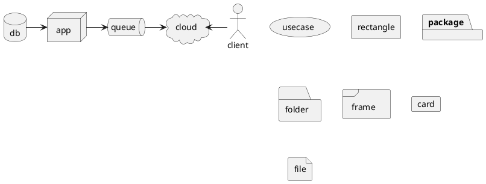
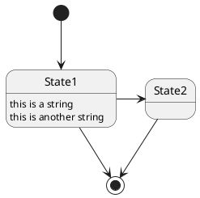

## Network Diagram



## State Diagram



## Sequence Diagrams

### Checkin

```plantuml
@startuml "Checkin"
    $participant("payer", "Payer") as Payer
    $participant("merchant", "Merchant") as Merchant
    $participant("server", "Swedbank Pay") as SwedbankPay

    Payer -> Merchant: Start Checkin
    activate Payer
        activate SwedbankPay
            Merchant -> SwedbankPay: $code("POST /psp/consumers")
            activate Merchant
                SwedbankPay --> Merchant: $code("rel:view-consumer-identification") <b>①</b>
                Merchant --> Payer: $code("rel:view-consumer-identification") <b>②</b>
            deactivate Merchant
            Payer <-> SwedbankPay: $code("<script src=rel:view-consumer-identification.href />")
        deactivate SwedbankPay
    deactivate Payer

    Payer -> Payer: $code("payex.hostedView.consumer()")

    activate Payer
        Payer -> SwedbankPay: Consumer identification <b>③</b>
        activate SwedbankPay
            SwedbankPay --> Payer: $code("onConsumerIdentified(consumerProfileRef)") <b>④</b>
        deactivate SwedbankPay

        Payer -> Merchant: $code("POST { consumerProfileRef }") <b>⑤</b>
    deactivate Payer

    activate Merchant
        Merchant -> Merchant: Store $code("consumerProfileRef")
    deactivate Merchant
@enduml
```

### Payment Menu

```plantuml
@startuml "Payment Menu"
    $participant("payer", "Payer") as Payer
    $participant("merchant", "Merchant") as Merchant
    $participant("server", "Swedbank Pay") as SwedbankPay

    Payer -> Merchant: Pay
    activate Payer
        activate Merchant
            Merchant -> SwedbankPay: $code("POST /psp/paymentorders { consumerProfileRef }") <b>①</b>
            activate SwedbankPay
                SwedbankPay --> Merchant: $code("rel:view-paymentorder")
            deactivate SwedbankPay
            Merchant --> Payer: $code("rel:view-paymentorder")
        deactivate Merchant

        Payer <-> SwedbankPay: $code("<script src=rel:view-paymentorder.href />")

        activate SwedbankPay
            Payer -> Payer: $code("payex.hostedView.paymentMenu()")
            SwedbankPay <-> Payer: Perform payment
        deactivate SwedbankPay
    deactivate Payer

    alt#fff #ebf8f2 completed payment
        SwedbankPay -> Payer: $code("onPaymentCompleted(paymentorder)")
        activate SwedbankPay
            activate Payer
                Payer -> Merchant: Check payment status
                activate Merchant
                    Merchant -> SwedbankPay: $code("GET paymentorder.id")
                    SwedbankPay --> Merchant: $code("rel:paid-paymentorder")
                    Merchant -> SwedbankPay: $code("GET rel:paid-paymentorder.href")
                    SwedbankPay --> Merchant: Completed Payment Order
                    Merchant --> Payer: Show receipt
                deactivate Merchant
            deactivate Payer
        deactivate SwedbankPay
    else failed payment
        SwedbankPay -> Payer: $code("onPaymentFailed(paymentorder)")
        activate SwedbankPay
            activate Payer
                Payer -> Merchant: Check payment status
                activate Merchant
                    Merchant -> SwedbankPay: $code("GET paymentorder.id")
                    SwedbankPay --> Merchant: $code("rel:failed-paymentorder")
                    Merchant -> SwedbankPay: $code("GET rel:failed-paymentorder.href")
                    SwedbankPay --> Merchant: Failed Payment Order
                    Merchant --> Payer: Show failure page
                deactivate Merchant
            deactivate Payer
        deactivate SwedbankPay
    end
@enduml
```

### Callback

```plantuml
@startuml "Callback"
    $participant("merchant", "Merchant") as Merchant
    $participant("server", "Swedbank Pay") as SwedbankPay

    SwedbankPay -> Merchant: $code("POST { payment activity }")
    activate Merchant
        activate SwedbankPay
            Merchant -> SwedbankPay: $code("GET paymentorder.id")
            SwedbankPay --> Merchant: Payment Order
        deactivate SwedbankPay

        Merchant -> Merchant: Update status
    deactivate Merchant
@enduml
```

### Capture

```plantuml
@startuml "Capture"
    $participant("merchant", "Merchant") as Merchant
    $participant("server", "Swedbank Pay") as SwedbankPay

    Merchant -> Merchant: Capture
    activate Merchant
        Merchant -> SwedbankPay: $code("GET paymentorder.id")
        activate SwedbankPay
            SwedbankPay --> Merchant: $code("rel:create-paymentorder-capture")
            Merchant -> SwedbankPay: $code("POST rel:create-paymentorder-capture.href")
            SwedbankPay --> Merchant: Capture status
        deactivate SwedbankPay
    deactivate Merchant
@enduml
```
