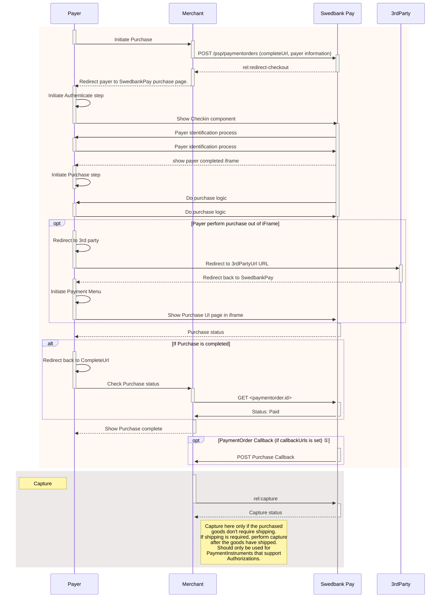
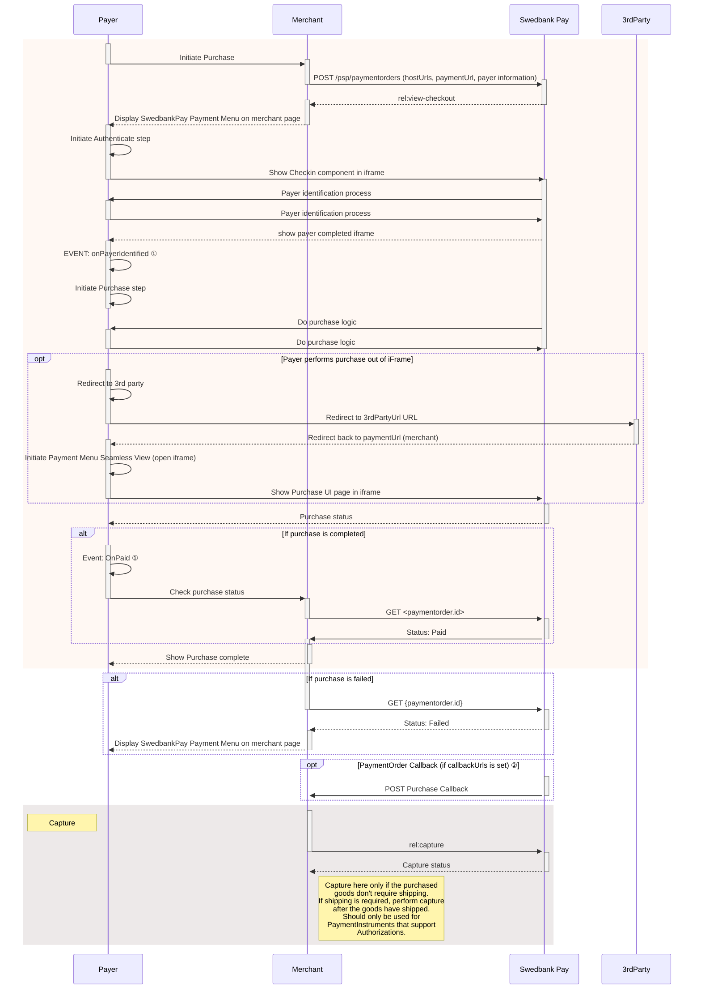
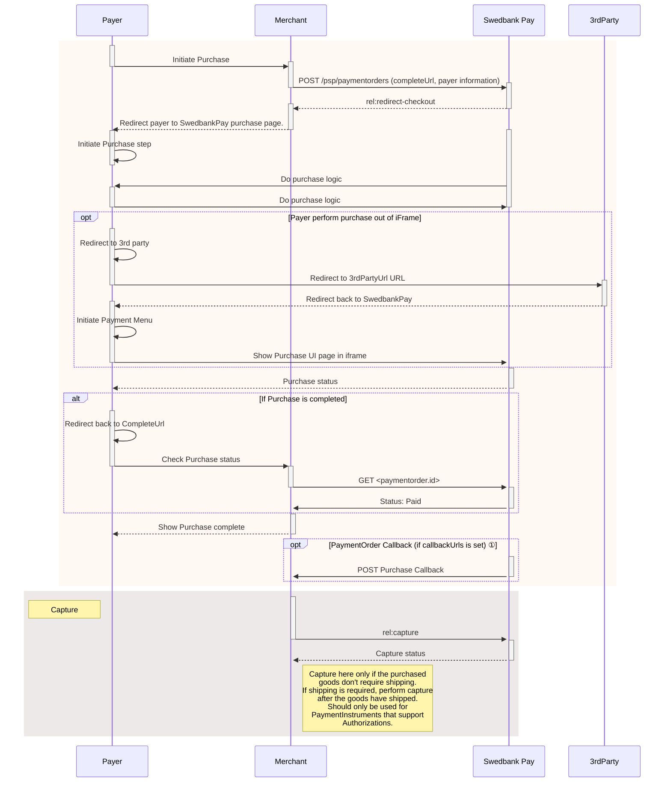
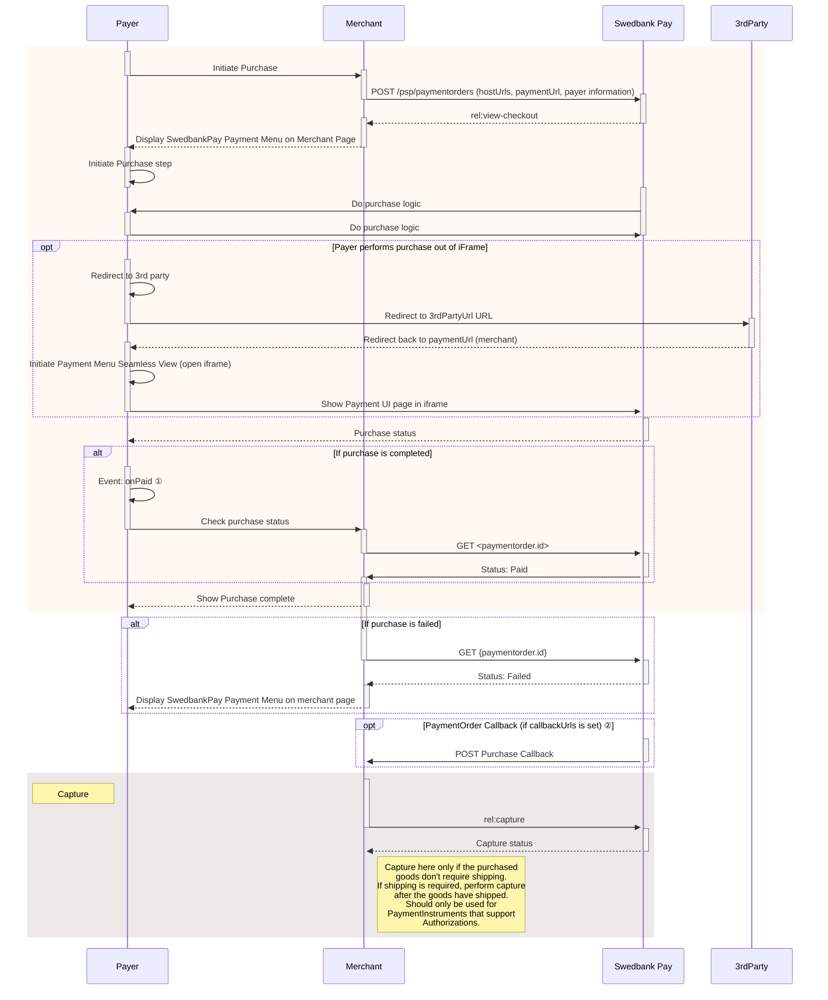

## Starter Seamless View

```mermaid
sequenceDiagram
    participant Payer
    participant Merchant
    participant SwedbankPay as Swedbank Pay
    participant 3rdParty

        rect rgba(238, 112, 35, 0.05)
            activate Payer
            Payer ->>+ Merchant: Initiate Purchase
            deactivate Payer
            Merchant ->>+ SwedbankPay: POST /psp/paymentorders (hostUrls, paymentUrl, payer information)
            deactivate Merchant
            SwedbankPay -->>+ Merchant: rel:view-checkout
            deactivate SwedbankPay
            Merchant ->> Merchant: Configure checkout on merchant page
            note left of Merchant: Start the checkout by providing 2 iframes <br/>* Checkin iframe <br/>* PaymentMenu iframe <br/>window.payex.hostedView.checkout(checkoutConfig)
            Merchant -->>- Payer: Display Swedbank Pay Checkin on merchant page
            note right of Merchant: windows.payex.hostedview.checkout().open("checkin")
            activate Payer
            Payer ->> Payer: Initiate Authenticate step
    deactivate Payer

 activate Payer
    Payer ->> SwedbankPay: Payer identification process
    deactivate Payer
    activate SwedbankPay
    SwedbankPay -->> Payer: show payer completed iframe
    SwedbankPay --> Merchant: EVENT: OnPayerIdentified ①
    deactivate SwedbankPay
    activate Merchant
    Merchant --> SwedbankPay : Get delivery information
    Merchant ->> Merchant : Calculate shipping
    Merchant -->+ Payer : Show shipping costs
    deactivate Merchant
    activate Payer
    Payer -->+ Merchant : Choose delivery
    deactivate Payer
    Merchant -> SwedbankPay : PATCH rel:update-order
    note left of Merchant: Merchant updates PaymentOrder with finalized price now that shipping costs have been chosen.

    Merchant -->+ Payer : Display SwedbankPay Payment Menu on merchant page
    note right of Merchant: windows.payex.hostedview.checkout().open("paymentmenu")
    Payer ->> SwedbankPay: Do purchase logic
    deactivate Payer
    deactivate SwedbankPay

                    opt Payer performs purchase out of iFrame
                    activate Payer
                    Payer ->> Payer: Redirect to 3rd party
                    Payer ->>+ 3rdParty: Redirect to 3rdPartyUrl URL
                    deactivate Payer
                    3rdParty -->>+ Payer: Redirect back to paymentUrl (merchant)
                    deactivate 3rdParty
                    Payer ->> Payer: Initiate Payment Menu Seamless View (open iframe)
                    Merchant ->>+ Payer: Show Purchase UI page in iframe
                    deactivate Payer
                end

                activate SwedbankPay
                SwedbankPay -->> Payer: Purchase status
                deactivate SwedbankPay

            alt If purchase is completed
            activate Payer
            Payer ->> Payer: Event: onPaid ①
            deactivate Payer
            Merchant ->>+ SwedbankPay: GET <paymentorder.id> expand Paid
            deactivate Merchant
            SwedbankPay ->>+ Merchant: Payment details, Status: Paid
            deactivate SwedbankPay
            end

                        activate Merchant
Merchant -->>- Payer: Show Purchase complete
            end


                alt If purchase is failed
                Merchant ->>+ SwedbankPay: GET {paymentorder.id}
                deactivate Merchant
                SwedbankPay -->>+ Merchant: Status: Failed
                deactivate SwedbankPay
                activate Merchant
                Merchant -->>- Payer: Display SwedbankPay Payment Menu on merchant page
                end

         opt PaymentOrder Callback (if callbackUrls is set) ②
                activate SwedbankPay
                SwedbankPay ->> Merchant: POST Purchase Callback
                deactivate SwedbankPay
         end

    rect rgba(81,43,43,0.1)
        activate Merchant
        note left of Payer: Capture
        Merchant ->>+ SwedbankPay: rel:capture
        deactivate Merchant
        SwedbankPay -->>- Merchant: Capture status
        note right of Merchant: Capture here only if the purchased<br/>goods don't require shipping.<br/>If shipping is required, perform capture<br/>after the goods have shipped.<br>Should only be used for <br>PaymentInstruments that support <br>Authorizations.
        end
```

## Business Redirect



## Business Seamless View



## Enterprise Redirect



## Enterprise Seamless View


## Payments Only Redirect


## Payments Only Seamless View


